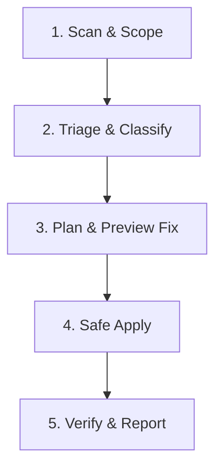

# Vibe Security - Agent Action Protocol (AAP) Skill

This skill guides AI agents (Antigravity, Gemini CLI, Claude Code, Cursor, Copilot) in auditing codebases, detecting security vulnerabilities, checking language quality/lint errors, and safely remediating issues using the Vibe Security engine.

## Agent Action Protocol (AAP) Workflow

When performing security audits, reviewing AI-generated code, or running `/securityCheck`, follow this 5-stage loop:



### Stage 1: Scan & Scope
- **General Scan:** Call `scan_project({ rootDir: "." })`.
- **Targeted Directory Scan:** If the user mentions a specific directory or folder (e.g. `src/api` or `frontend`), call `scan_project({ rootDir: ".", targetPath: "src/api" })`.
- **Detailed Scan:** For deep analysis with elevated finding limits, call `scan_project({ rootDir: ".", detailed: true })`.
- **Lint / Code Quality:** To check language-specific anti-patterns (empty catch, floating promises, type bypasses, syntax errors), include `layers: ["lint"]`.

### Stage 2: Triage & Classify
- Group findings into:
  - 🛡️ **Security Vulnerabilities** (`CRITICAL` -> `HIGH` -> `MEDIUM` -> `LOW` -> `INFO`)
  - 🧹 **Language & Lint Quality Issues** (`LINT-001` - `LINT-005`)
- Identify findings that are marked as auto-fixable (`fix` present).
- For complex vulnerabilities, inspect detailed threat models and remediation guides using `get_rule_detail(ruleId)`.

### Stage 3: Plan & Preview Fix (Dry-Run)
- **NEVER** apply blind changes without inspection.
- Call `apply_fix` with `dryRun: true` (or `vibe-security scan . --fix --dry-run`).
- Present the unified diff to the user or review policy.
- For issues without automated patches, use the remediation steps from the rule definition to construct a minimal, non-breaking patch.

### Stage 4: Safe Apply
- Once verified or approved, call `apply_fix` with `dryRun: false` (or `vibe-security scan . --fix`).
- Limit fixes to specific rules or files using `ruleIds: ["FE-001", "LINT-001"]` or `file: "src/api/auth.ts"`.

### Stage 5: Verify & Report
- Re-run `scan_file` or `scan_project` to ensure:
  1. Target vulnerabilities and lint issues are resolved.
  2. No regressions were introduced.
- Confirm `Security.md` has been updated with the latest audit summary.

---

## MCP Tools Reference

| MCP Tool | Purpose | Key Arguments |
| :--- | :--- | :--- |
| `scan_project` | Full project or targeted folder scan | `rootDir`, `targetPath`, `detailed`, `layers`, `languages`, `ruleIds`, `baselinePath`, `includeFixes` |
| `scan_file` | Single file fast check | `filePath`, `layers`, `ruleIds` |
| `list_rules` | List available rules and layers | `layer` |
| `get_rule_detail` | Detailed remediation & threat specs | `ruleId` |
| `apply_fix` | Preview or apply automated patches | `rootDir`, `ruleIds`, `file`, `dryRun` (default `true`) |

---

## CLI Reference

```bash
# Scan full project (generates Security.md)
vibe-security scan .

# Scan specific folder (e.g. backend api)
vibe-security scan src/api/

# Detailed deep scan with elevated limits
vibe-security scan . --detailed

# Scan language quality & lint rules
vibe-security scan . --lint

# Preview automated fixes without modifying disk
vibe-security scan . --fix --dry-run

# Apply automated fixes
vibe-security scan . --fix

# CI SARIF generation for GitHub Code Scanning
vibe-security scan . --format sarif -o vibe-security.sarif

# Update baseline for regression checks
vibe-security baseline update
```
