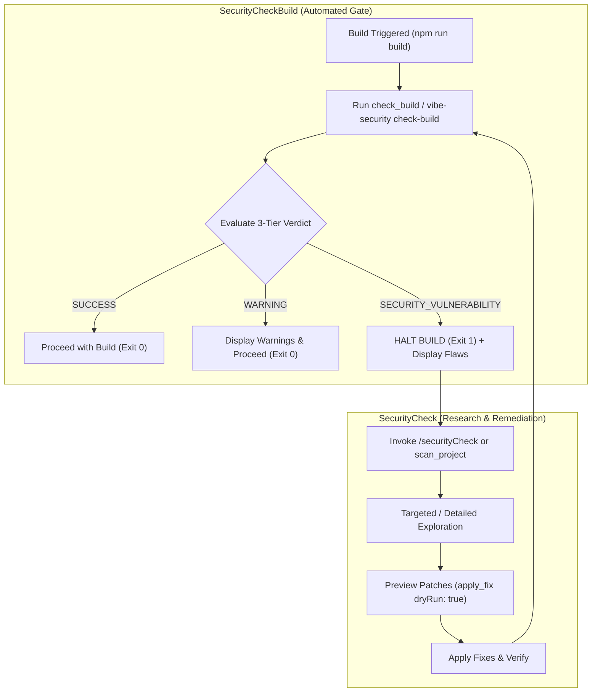

# Vibe Security - Agent Action Protocol (AAP) Skill

This skill provides AI coding assistants (Antigravity, Gemini CLI, Claude Code, Cursor, Copilot) with two primary workflows:
1. **`SecurityCheckBuild` (Automated Build Gatekeeper):** Runs before builds/deployments to enforce a strict 3-tier verdict and block releases if critical/high vulnerabilities exist.
2. **`SecurityCheck` (Research, Audit & Remediation):** In-depth exploration, folder-targeted scanning, issue triage, and collaborative auto-remediation between agent and developer.

---

## Dual Workflow Architecture



---

## Workflow 1: `SecurityCheckBuild` (Pre-Build Gate)

Whenever a project build or packaging action is initiated (e.g. `npm run build`, `vite build`, `next build`, Docker build, or CI build), the **`SecurityCheckBuild`** gate must run first.

### 3-Tier Verdict Enforcement

| Verdict | Condition | Exit Code | Action |
| :--- | :--- | :---: | :--- |
| **`SUCCESS`** | 0 blocking flaws, 0 critical/high security issues | `0` | Build proceeds safely. |
| **`WARNING`** | Non-blocking issues detected (medium, low, info, or lint warnings) | `0` | Warnings displayed prominently in terminal/report; build proceeds without halting. |
| **`SECURITY_VULNERABILITY`** | 1+ Critical or High security vulnerabilities found | `1` | **BUILD IS HALTED**. Terminal and `Security.md` display exact files, lines, and impact. |

### How to Execute:
- **As AI Agent:** Call MCP tool `check_build({ rootDir: ".", fix: true })`.
  - With `fix: true`: Automatically applies available patches for fixable vulnerabilities on-the-fly. If all blocking flaws are resolved, the verdict becomes `SUCCESS` or `WARNING`, and the build proceeds smoothly!
  - If `verdict === 'SECURITY_VULNERABILITY'`: Halts build immediately, displays unpatched flaws, and switches to `SecurityCheck` remediation mode.
- **In Shell / CI:** Run `npx vibe-security check-build . --fix` (automatically configured as `"prebuild": "vibe-security check-build --fix"` in `package.json` upon `vibe-security init`).

---

## Workflow 2: `SecurityCheck` (Research, Audit & Interactive Remediation)

When the user asks to inspect security, when debugging issues, or when unblocking a halted build, follow the 5-stage **Agent Action Protocol (AAP)**:

### 1. Scope & Research
- **General Scan:** `scan_project({ rootDir: "." })`
- **Targeted Directory Scan:** If focusing on a specific component, pass `targetPath`:
  ```json
  { "rootDir": ".", "targetPath": "src/api" }
  ```
- **Detailed Deep Scan:** For deep token inspection with elevated limits:
  ```json
  { "rootDir": ".", "detailed: true }
  ```
- **Language & Lint Quality:** To audit unhandled errors, floating promises, or syntax traps:
  ```json
  { "rootDir": ".", "layers": ["lint"] }
  ```

### 2. Triage & Understand
Group findings logically:
- 🛡️ **Security Vulnerabilities:** (`CRITICAL` -> `HIGH` -> `MEDIUM` -> `LOW`)
- 🧹 **Code Quality & Lint:** (`LINT-001` - `LINT-005`)
- Inspect deep threat intelligence for complex rules: `get_rule_detail({ ruleId: "BE-004" })`.

### 3. Plan & Preview Fix (Dry-Run)
- Never modify files blindly.
- Run `apply_fix({ dryRun: true })` to inspect unified diffs.
- For issues without built-in automated patches, use the suggested remediation pattern to draft minimal, clean fixes following SOLID principles.

### 4. Safe Apply
- Apply patches using `apply_fix({ dryRun: false })`.
- Scope fixes per rule or file if desired: `apply_fix({ dryRun: false, ruleIds: ["FE-001"], file: "src/auth.ts" })`.

### 5. Verify & Re-Gate
- Re-run `check_build({ rootDir: "." })`.
- Confirm the verdict transitions to `SUCCESS` or `WARNING`.
- Ensure `Security.md` reflects the clean state.

---

## MCP Tools Reference

| MCP Tool | Purpose | Key Arguments |
| :--- | :--- | :--- |
| `check_build` | **Pre-build gatekeeper (3-tier verdict)** | `rootDir`, `targetPath`, `detailed`, `blockSeverities`, `reportPath` |
| `scan_project` | Deep project/folder audit & research | `rootDir`, `targetPath`, `detailed`, `layers`, `languages`, `ruleIds` |
| `scan_file` | Single file rapid check | `filePath`, `layers`, `ruleIds` |
| `apply_fix` | Preview & apply unified diff patches | `rootDir`, `ruleIds`, `file`, `dryRun` (default: `true`) |
| `get_rule_detail` | Detailed threat specs & remediation steps | `ruleId` |
| `list_rules` | Catalog of all active rules & layers | `layer` |

---

## CLI Reference

```bash
# Automated 3-tier pre-build gate (blocks on critical/high)
vibe-security check-build .

# Pre-build gate on specific directory
vibe-security check-build src/

# Full interactive research scan
vibe-security scan . --detailed

# Folder-targeted scan
vibe-security scan src/api/

# Language quality & syntax lint check
vibe-security scan . --lint

# Preview automated remediation diffs
vibe-security scan . --fix --dry-run

# Apply auto-fixes
vibe-security scan . --fix

# Initialize config, slash commands, agent skills, and prebuild hook
vibe-security init
```
